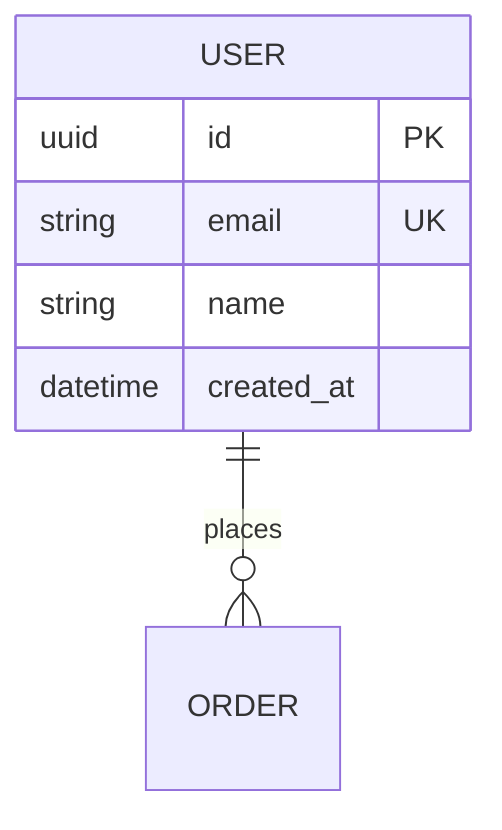

# App Architect Brainstorm

Collaborative architecture design through structured Socratic brainstorming. Agent acts as a senior architect paired with the developer. The stack is a consequence of the requirements — never a starting assumption.

**Output: Architecture specification documents and diagrams only. No source code. No executable files.**

## What This Skill Produces

| Deliverable | Format | Purpose |
|-------------|--------|---------|
| Domain Specification | Markdown | Bounded contexts, entities, invariants, events |
| ER Database Diagram | Mermaid UML | Complete schema with types and relationships |
| Architecture Blueprint | Mermaid diagrams | Layer structure, component model, data flow |
| API Contract | Markdown tables | Endpoints, methods, request/response shapes |
| Stack Decision Record | Markdown table | Each layer choice with justification |
| Architecture Decision Records | Markdown | ADR-xxx for each significant decision |
| Component Specification | Markdown | Per-component responsibilities and interfaces |
| Architecture Contract | Markdown | Machine-verifiable rules for the project |
| Product Truth Contract | Markdown | Observable critical journey, runtime topology, failure signals, and future E2E proof |
| Guardian Checklist | Markdown | Validation rules to prevent architectural drift |
| UI/UX Design Package | Static HTML pages | One self-contained mockup per key screen + user flows, screen inventory, design tokens |

**What this skill does NOT produce:**
- ❌ Source code files (`.ts`, `.py`, `.go`, etc.)
- ❌ Production front-end code (React/Vue/Angular components, CSS frameworks, build setups) — HTML mockups are static design artifacts, the ONLY exception
- ❌ Configuration files (`package.json`, `Dockerfile`, etc.)
- ❌ Executable scripts
- ❌ Boilerplate projects
- ❌ Git repositories

## Core Philosophy

- **Socratic method**: Ask before proposing. Every architectural decision must be justified through questioning.
- **Challenge mode**: Agent challenges weak decisions with data-driven counter-arguments.
- **Stack emerges from need**: No framework or language is pre-selected. The architecture phase determines the stack.
- **Archetype-driven**: Different patterns for different product types.
- **Specification-first**: The architecture document IS the deliverable. Implementation comes later.

## Two Operating Modes

### Mode A: Greenfield (Start from Scratch)

When the user has no existing codebase — designing a new application.

```
Phase 1: Domain Discovery     → Business model, entities, constraints, archetype
Phase 1.5: Product Truth      → Observable outcome contract and required runtime topology
Phase 2: Stack Selection      → Language, frameworks, databases (evidence-based)
Phase 3: Database Modeling    → ER diagram (Mermaid), relations, access patterns
Phase 4: Architecture Design  → Layers, components, services, API design
Phase 4.6: UI/UX Design       → User flows, design tokens, static HTML mockups (UI archetypes only)
Phase 5: Architecture Package → All specs consolidated, ADRs, guardian contract
```

### Mode B: Reverse Engineering (Existing Codebase)

When the user provides an existing codebase — analyze, document, and plan migration.

```
Phase R1: Codebase Discovery     → Understand what exists (files, deps, patterns)
Phase R2: Architecture Mapping   → Map files to layers (or identify no layers)
Phase R3: Violation Detection    → Find anti-patterns, coupling, leaks
Phase R3.5: Product Truth        → Reconstruct the real runnable journey and its topology
Phase R4: Architecture Blueprint → Produce diagrams of the AS-IS state
Phase R5: Migration Plan         → Roadmap to TO-BE Clean Architecture
```

**Trigger phrases for Mode B:**
- "Voici mon projet, aide-moi à comprendre l'architecture"
- "J'ai un legacy, comment le refactoriser ?"
- "Mon codebase est devenu un plat de spaghetti"
- "Documente l'architecture de mon app"
- "Review mon projet et dis-moi ce qui va pas"
- "Je veux passer en Clean Architecture, par où commencer ?"
- "Analyse ce repo" (with uploaded files or URL)

**How to detect the mode:**
- User uploads files or provides file paths → **Mode B**
- User describes an idea without existing code → **Mode A**
- User pastes directory structure → **Mode B**

---

## Phase 1: Domain Discovery

### Step 1A: Identify the Product Archetype

The archetype determines everything that follows. Ask:

- **"What are you building?"** — Describe the product in one sentence.
- **"Who uses it and how?"** — End users? Developers? Internal team? Machines?
- **"What triggers the need?"** — User action? Scheduled job? External event? Real-time stream?

Map the answer to an archetype:

| Archetype | Description | Typical Patterns |
|-----------|-------------|-----------------|
| **Web Application** | Browser-based UI + backend + DB | Frontend + API + DB |
| **Mobile Application** | iOS/Android app with backend | Native/Flutter/RN + API + DB |
| **API-Only Service** | Backend consumed by other services | Lightweight framework + DB + docs |
| **ML/Inference API** | Model serving, prediction endpoints | FastAPI/Go/Rust + model runtime + cache |
| **Real-Time System** | WebSocket, chat, live data | Event-driven + pub/sub + connections |
| **CLI Tool** | Command-line utility | Native language, minimal deps |
| **Desktop Application** | Native GUI app | Tauri/Electron + local/remote DB |
| **Data Pipeline** | ETL, stream processing | Queue + workers + data warehouse |

### Step 1B: Socratic Domain Questions

Challenge the domain understanding before any technical decision:

1. **"What problem does this solve? What changes if this product disappears?"**
2. **"Who are the users? What do they do in the first 5 minutes?"**
3. **"What is the core entity around which everything revolves?"**
4. **"Describe the most critical user journey end-to-end."**
5. **"What must always be true, no matter what?"** (business invariants)
6. **"What data changes most frequently? What is read-heavy?"**
7. **"What external systems must you talk to?"**
8. **"What is the scale in 6 months? Users, requests/day, data volume?"**
9. **"What is the team size and experience?"**
10. **"What is the budget for infrastructure?"**
11. **"What exact sentence may we say only when the product truly works?"**
12. **"What is the first meaningful action after the initial screen or response?"**

### Step 1C: Extract the Domain Model

From answers, identify:
- **Bounded contexts** (separate sub-domains with their own language)
- **Core entities** and their invariants
- **Aggregate roots** (consistency boundaries)
- **Domain events** (things that happen and other parts care about)
- **Read vs write patterns** (CQRS hint?)

**Output**: Domain specification document with validated archetype, entities, constraints.

Reference: [references/brainstorming-method.md](references/brainstorming-method.md)

---

## Phase 1.5: Product Truth Contract

Architecture quality and product success are separate claims. Before selecting
the stack, define one Product Truth Contract per P0 critical journey:

- actor and intended starting state;
- exact trigger, observable outcome, and first meaningful continuation;
- complete required runtime topology (UI, APIs, workers, stores, queues,
  assets, auth, external systems, configuration);
- concrete failure signals;
- forbidden substitutes such as mocks, manual database edits, hidden setup,
  skipped services, or product-specific patches outside the intended workflow;
- one planned deterministic E2E test that can fail on the user's exact symptom;
- a same-scenario parity bar when a reference product is named.

Trace every required topology item to a component and operational owner in the
later architecture. This phase produces a specification only and must end in
state `architected`, never `product_verified`.

When available, use `product-truth-gate` during implementation and validation
to execute this contract. The architecture package must remain usable without
that skill by containing the full contract itself.

---

## Phase 2: Stack Selection (Evidence-Based)

### The Rule
**Never propose a stack before Phase 1 is complete.**

### How the Decision Works

The agent asks a **cascade of questions**. Each answer narrows the options.

#### Step 2A: Language Selection

```
"What languages does your team know well?"
  → If team has strong preference AND not disqualifying → Use it
  → If no preference → Continue to technical fit

Technical fit:
  "Need sub-millisecond latency?" → Rust, C++, Go
  "Need ML integration?" → Python
  "Need rapid prototyping?" → TypeScript, Python, Ruby
  "Mobile app?" → Dart, Kotlin, Swift
  "10K+ simultaneous connections?" → Go, Rust, Elixir
  "Enterprise/legacy?" → Java, C#, Kotlin

  DEFAULT → TypeScript (fullstack), Go (backend), Python (data/AI) — challenge this default
```

#### Step 2B: Database Selection

```
"Need ACID transactions + complex relationships?" → PostgreSQL (starting point)
"Need flexible schema?" → MongoDB (justify why relational model doesn't fit)
"Time-series?" → TimescaleDB
"Full-text search?" → PostgreSQL tsvector, or Elasticsearch if ranking is complex
"Cache?" → Redis

STARTING POINT → PostgreSQL (challenge if the domain justifies NoSQL)
```

#### Step 2C: Framework Selection

Depends on archetype + language. See [references/stack-selection-trees.md](references/stack-selection-trees.md).

#### Step 2D: Architecture Style

```
Team 1-3? → Monolith (starting point, challenge if specific needs arise)
Team 4-8? → Modular monolith (separate deployable modules)
Team 9+? → Evaluate microservices (but justify with team structure, not hype)

Read/write > 10:1? → Consider CQRS (measure first, don't assume)
Event-heavy? → Event-driven (but not every CRUD app needs Kafka)
Global multi-region? → Eventual consistency (accept the trade-offs)
```

### Output of Phase 2

A **Stack Decision Record**:

| Layer | Choice | Justification | Alternatives Rejected |
|-------|--------|---------------|----------------------|
| Language | ... | ... | ... |
| Framework | ... | ... | ... |
| Database | ... | ... | ... |
| Cache | ... | ... | ... |
| Architecture | ... | ... | ... |

---

## Phase 3: Database Modeling

### ER Diagram (Mermaid)

Design using Mermaid `erDiagram`:



### Rules
- Cardinality explicit: `||--o{`, `}o--||`, `}o--o{`
- PK, FK, UK, indexes marked
- Data types match chosen database engine
- Audit fields: `created_at`, `updated_at`
- Soft delete: `deleted_at` unless justified
- Normalize to 3NF; denormalize only with measured justification

**Output**: Complete ER diagram + table schemas.

Reference: [references/database-modeling-uml.md](references/database-modeling-uml.md)

---

## Phase 4: Architecture Design

### Layered Architecture Blueprint

Produce Mermaid diagrams showing:
1. **Layer diagram**: domain → application → infrastructure → interface
2. **Component diagram**: entry points, use cases, repositories, adapters
3. **Sequence diagram**: critical user journey end-to-end
4. **Data flow**: request lifecycle through all layers

### Universal Component Model

For each system, specify:
1. **Entry points** (HTTP routes, CLI commands, WS handlers, consumers)
2. **Use cases** (one per user story — name and responsibility)
3. **Domain entities** (aggregate roots, invariants, business methods)
4. **Repository interfaces** (ports — method signatures, NOT implementation)
5. **Adapters** (infrastructure — what they implement, NOT how)
6. **Cross-cutting concerns** (auth, logging, metrics, configuration)

### Per-Archetype Architecture

Reference: [references/archetype-patterns.md](references/archetype-patterns.md)

**Output**: Architecture blueprint with diagrams + component specification + API contract.

---

## Phase 4.5: Architecture Rules — NON NEGOTIABLE

Before finalizing, these rules are absolute:

### Rule 1: The Folder Structure Is the Architecture

```
src/
├── domain/               ← ZERO external dependencies
│   ├── entities/         ← Classes with behavior and invariants
│   ├── value-objects/    ← Validated types
│   ├── repositories/     ← INTERFACES ONLY
│   ├── events/           ← Domain events
│   └── services/         ← Multi-entity domain logic
├── application/          ← Orchestration, ZERO HTTP/ORM
│   ├── use-cases/        ← One per user story
│   ├── dto/              ← Input/output contracts
│   └── ports/            ← Outgoing interfaces
├── infrastructure/       ← Concrete implementations
│   ├── persistence/      ← Repositories + mappers + migrations
│   ├── cache/            ← Cache adapter
│   ├── external/         ← Third-party API clients
│   └── http/             ← Internal service clients
└── interface/            ← The ONLY place with HTTP/framework code
    ├── http/             ← Route handlers
    ├── middleware/       ← Auth, rate limiting, logging
    └── validators/       ← Request validation
```

### Rule 2: Domain Entities Are NOT Database Schemas

Entities are classes with behavior. ORM models are infrastructure adapters with mappers.

### Rule 3: Repository Interfaces Live in Domain

`IOrderRepository` in `domain/repositories/`. `OrderDrizzleRepository` in `infrastructure/persistence/`.

### Rule 4: Use Cases Follow the 6-Step Structure

1. Validate input DTO → 2. Fetch entities → 3. Call domain methods → 4. Save → 5. Publish events → 6. Return DTO

### Rule 5: Dependency Injection Is Mandatory

Constructor injection everywhere. No `new` inside methods.

### Rule 6: The Mapper Pattern Is Mandatory

Every repository has a mapper: `toDomain(row)` and `toPersistence(entity)`.

---

## Phase 4.6: UI/UX Design via HTML Prototypes

**Applies to**: all archetypes with a human interface (web, mobile, desktop, real-time). Skip for API-only and CLI archetypes — state why and substitute payload examples or interaction transcripts.

UI/UX is a first-class architecture deliverable, not decoration. The interface layer cannot be specified without knowing what users actually see and do.

### The 5 Steps

1. **D1 — UX Discovery**: users, context, real data density, brand, accessibility, languages, 3-7 key screens. Runs alongside Phase 1 questions.
2. **D2 — User flows**: Mermaid flowchart of the critical journey + screen inventory table with per-screen states and priorities.
3. **D3 — Design tokens**: full token set (surfaces, text, accent, severity, typography, spacing, radius) as CSS custom properties, with WCAG AA contrast stated. The `:root` token block is byte-identical across all mockup files — it IS the design system.
4. **D4 — HTML mockups**: one self-contained `.html` file per key screen + an `index.html` gallery. Each screen file opens with a contract header comment (route, purpose, component inventory, states, data shown) so the mockup doubles as a build spec. Realistic fake data in the product's real language (NEVER lorem ipsum; include the longest realistic value). Empty / loading / error / success states for every P0 screen. Semantic HTML, one obvious primary action per screen, mobile-first at 390px by default.
5. **D5 — Review loop**: user clicks through the gallery, iterate BEFORE finalizing the package. UX findings often change the API contract.

### Hard Boundaries

- HTML mockups are **design artifacts, not production code**: no framework, no build step, no API calls, no reusable component system.
- They are the ONLY code-like artifact this skill produces.
- The implementation team rebuilds them in the chosen stack; mockup markup is a reference, not a starting codebase.

Reference: [references/ui-ux-design.md](references/ui-ux-design.md) — **read in full before running this phase**, together with [references/ui-patterns.md](references/ui-patterns.md) (viewport doctrine, shell and screen patterns, density rules, visual contract).

**Output**: `design/` folder (`index.html` + `screen-<name>.html` per key screen), user flow diagram, screen inventory, design tokens table, UX decision notes feeding the API contract.

---

## Phase 5: Architecture Package

### Deliverables to Produce

1. **Architecture Specification** (from template): Complete spec document
2. **ER Diagram**: Mermaid `erDiagram` with all tables
3. **Architecture Blueprint**: Mermaid diagrams (layers, components, sequences)
4. **API Contract**: Endpoint table with methods, DTOs, error codes
5. **Stack Decision Record**: Justified choices with rejected alternatives
6. **ADR files** (from template): One per significant decision
7. **Architecture Contract**: Machine-verifiable rules for the project
8. **Product Truth Contract**: P0 journey, topology, failure signals, forbidden substitutes, planned E2E proof
9. **UI/UX Design Package** (UI archetypes only): HTML mockups gallery, user flows, screen inventory, design tokens
10. **Guardian Checklist**: Rules to prevent architectural and product-proof drift during implementation

### Architecture Contract

Generate `ARCHITECTURE_CONTRACT.md` specifying:
- Forbidden import rules per layer
- Required folder structure
- Naming conventions
- Feature evolution patterns
- Per-stack overrides

Reference template: [assets/ARCHITECTURE_CONTRACT.md](assets/ARCHITECTURE_CONTRACT.md)

### Guardian System for Implementation Phase

Provide the implementation team with:
- `assets/VALIDATION-CHECKLIST.md` — 10-point validation checklist
- `references/development-guardian.md` — Feature evolution patterns
- Verification commands (grep patterns to check layer boundaries)

**Note**: The guardian validates the implementation against this architecture contract. It does not generate code.
It must also reject completion claims whose Product Truth Contract has not been
executed at the required proof level; architecture checks cannot substitute for
that future runtime evidence.

---

## Challenge Mode: Anti-Patterns to Flag

| Anti-Pattern | Challenge |
|-------------|-----------|
| **Framework-first decision** | "You chose X before defining the problem. What does X solve for YOUR use case?" |
| **Microservices for small team** | "Your team has N people. Who maintains the operational complexity?" |
| **Anemic Domain Model** | "Where is the business logic? What protects entity invariants?" |
| **Premature optimization** | "Have you measured? What's the actual bottleneck?" |
| **No API versioning** | "When this contract changes, what happens to existing consumers?" |
| **Missing idempotency** | "If this operation runs twice, is the result the same?" |
| **Cache without invalidation** | "How do you know when to invalidate?" |
| **UI designed with lorem ipsum** | "Show me the real longest value. Does the layout survive it?" |
| **No empty/error states** | "Zero items is the FIRST thing a new user sees. What does the API-down screen look like?" |
| **UX skipped for a UI archetype** | "You specified an interface layer without knowing what users see. Mock the key screens first." |
| **Internal-green means product-done** | "Which Product Truth Contract proves the critical journey and its first meaningful continuation?" |
| **Single component for a multi-service journey** | "Which required API, worker, store, asset, auth, or external dependency is being skipped?" |
| **Screenshot or HTTP 200 as E2E proof** | "Could this evidence pass while the next user action, API call, or asset still fails?" |

## Reference Loading Guide

### Design-Time References (Mode A — Greenfield)

- **Brainstorming**: `references/brainstorming-method.md` — Socratic questioning banks, 5 Whys, decision frameworks
- **Stack selection**: `references/stack-selection-trees.md` — Language/framework/DB decision trees
- **Database patterns**: `references/database-modeling-uml.md` — Mermaid ER syntax, 7 advanced patterns, normalization
- **Archetype patterns**: `references/archetype-patterns.md` — Per-archetype architecture models
- **UI/UX design**: `references/ui-ux-design.md` — UX discovery questions, user flows, design tokens, static HTML mockup rules, review loop. **Read before Phase 4.6.**
- **UI pattern catalog**: `references/ui-patterns.md` — viewport doctrine, app shell and screen patterns, dashboard doctrine, density rules, visual hierarchy, visual contract for machine-consumable mockups. **Read with ui-ux-design.md at Step D3.**
- **Implementation guidance**: `references/development-guardian.md` — Feature evolution patterns, regression prevention

### Reverse Engineering References (Mode B — Existing Codebase)

- **Reverse architecture**: `references/reverse-architecture.md` — Codebase discovery, layer mapping, violation detection, migration planning with Strangler Fig pattern. **Read immediately when user provides existing files.**
- **Audit template**: `assets/templates/architecture-audit-template.md` — Standardized output format for legacy assessment

### Templates and Contracts

- **Architecture spec**: `assets/templates/arch-spec-template.md` — Full specification document
- **ADR template**: `assets/templates/adr-template.md` — Architecture Decision Record
- **Architecture contract**: `assets/ARCHITECTURE_CONTRACT.md` — Machine-verifiable rules
- **Validation checklist**: `assets/VALIDATION-CHECKLIST.md` — 10-point anti-cheat checklist

### Architecture Design Guides

Located in `assets/architecture-design-guides/`. These are pattern catalogs only — no executable code.

- **generic-backend/** — 4-layer Clean Architecture patterns for 6 languages (TS, Python, Go, Rust, Java, C#)
- **generic-api/** — API-only service patterns
- **generic-fullstack/** — Fullstack web application patterns
- **generic-inference/** — ML/Inference service patterns
