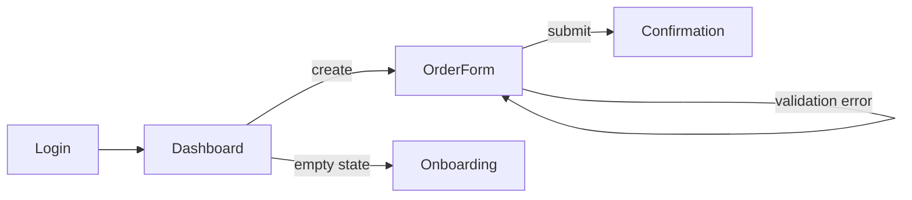

# UI/UX Design via HTML Prototypes

## Table of Contents
1. [Philosophy](#philosophy)
2. [When This Applies](#when-this-applies)
3. [Step D1: UX Discovery](#step-d1-ux-discovery)
4. [Step D2: User Flows and Screen Inventory](#step-d2-user-flows-and-screen-inventory)
5. [Step D3: Design Tokens](#step-d3-design-tokens)
6. [Step D4: HTML Mockups](#step-d4-html-mockups)
7. [Step D5: Review Loop](#step-d5-review-loop)
8. [UI/UX Anti-Patterns to Challenge](#uiux-anti-patterns-to-challenge)
9. [Output and Handoff](#output-and-handoff)
10. [Validation Checklist](#validation-checklist)

---

## Philosophy

UI/UX is not decoration applied after architecture — it **is** part of the architecture. The interface layer (`interface/`) cannot be specified without knowing what humans actually see and do.

The medium is the **static HTML mockup**: one self-contained `.html` file per key screen. HTML is the right tool because:

- It renders in any browser — zero tooling, zero build step, instantly reviewable.
- It forces real layout, real spacing, real typography — unlike wireframe boxes that hide data-density problems.
- It is a **design artifact, not production code**: no framework, no state management, no business logic. The implementation team rebuilds it properly in the chosen stack.

**Hard boundary**: HTML mockups are the ONLY code-like artifact this skill produces. They contain no framework code, no API calls, no reusable component system. They exist to validate UX decisions visually before the architecture package is finalized.

## When This Applies

| Archetype | UI/UX Phase? | Notes |
|-----------|--------------|-------|
| Web Application | **Yes — mandatory** | Full mockup set |
| Mobile Application | **Yes** | Mock key screens at mobile viewport (375px) |
| Desktop Application | **Yes** | Mock the primary window layouts |
| Real-Time System | **Yes** | Include live-state variations (connected, reconnecting, stale) |
| API-Only Service | **No** | Replace with example request/response payloads |
| CLI Tool | **No** | Replace with text-based interaction transcripts |
| ML/Inference API | **Optional** | Only if a demo/console UI exists |
| Data Pipeline | **Optional** | Only if a monitoring dashboard exists |

If the archetype has no UI, skip this phase and say why.

## Step D1: UX Discovery

Ask before drawing anything. UX questions run alongside Phase 1 domain questions.

**Users and context**:
- "Who is the primary user? Describe their environment: desk, phone in the field, shared kiosk?"
- "What does the user do in the first 5 minutes? What is the 'aha' moment?"
- "How often do they use it: daily tool, weekly check, once-ever setup?"
- "What is the user's emotional state when they open this? (stressed operator vs curious explorer)"

**Content and density**:
- "Show me the REAL data: how many columns in that table? How long are the names? 10 items or 10,000?"
- "What is the single most important piece of information on the main screen?"
- "What does the user need to do when something goes WRONG?"

**Constraints and references**:
- "Is there an existing brand: logo, colors, fonts? Or do we define everything?"
- "Name 2-3 products whose UX you admire. What specifically do you like?"
- "Accessibility requirements? (legal WCAG obligation, aging users, screen readers)"
- "Which languages must the UI support? (impacts layout: FR text is ~20% longer than EN, RTL flips everything)"
- "Dark mode required, nice-to-have, or never?"

**Scope control**:
- "What are the 3 to 7 KEY screens? Not every screen — the ones that define the product."
- "What is the critical user journey we mock end-to-end?"

## Step D2: User Flows and Screen Inventory

Before any visual design, produce:

1. **A Mermaid flowchart** of the critical journey (screens as nodes, actions as edges):

2. **A screen inventory table** — every screen to mock, with its purpose and states:

| Screen | Purpose | Data shown | States to design | Priority |
|--------|---------|-----------|------------------|----------|
| Dashboard | Daily entry point | KPIs, recent items | empty / loading / populated / error | P0 |
| Order form | Core creation flow | Form + summary | default / validating / error / success | P0 |

**Rule**: every P0 screen must have its **empty, loading, error, and success** states designed. Missing states are the #1 cause of "the mockup looked great but the real app feels broken."

## Step D3: Design Tokens

Define the visual system as a **tokens table** BEFORE mocking screens. Tokens are captured as CSS custom properties inside each mockup.

| Token | Value | Rationale |
|-------|-------|-----------|
| `--color-primary` | ... | Brand / trust / action |
| `--color-surface` | ... | Background hierarchy |
| `--color-danger` | ... | Errors, destructive actions |
| `--font-body` | ... | Readability for the content type |
| `--font-size-base` | 16px minimum | Accessibility |
| `--space-unit` | 4px or 8px grid | Consistent rhythm |
| `--radius` | ... | Personality: sharp = serious, round = friendly |

Rules:
- **Contrast**: body text must pass WCAG AA (4.5:1). State the checked ratio.
- **Typography scale**: max 3-4 sizes. More = chaos.
- **One accent color** for primary actions. If everything is highlighted, nothing is.
- Justify each choice against the user's emotional context from D1 (a trading terminal and a children's app do not share tokens).

## Step D4: HTML Mockups

### File Rules

- **One `.html` file per screen**, named `screen-<name>.html`, plus an `index.html` gallery linking all screens.
- **Fully self-contained**: all CSS inline in `<style>`, no build step, no external dependencies (optional: one CDN font link).
- **Realistic fake data**: real-length names, plausible numbers, actual French/English copy as appropriate. NEVER lorem ipsum — lorem ipsum hides layout-breaking content.
- **No framework, no logic**: no React, no Tailwind build, no fetch calls. Minimal inline JS allowed ONLY for preview interactions (tab switching, modal open) — never for business logic.
- **Mobile-first**: design at the primary viewport first (state which: 375px mobile or 1440px desktop), then verify the other breakpoint does not collapse.

### UX Rules (non-negotiable)

1. **Semantic HTML**: `<nav>`, `<main>`, `<button>`, `<label for>` — not soup of `
`.
2. **One obvious primary action per screen.** If the user must think "where do I click?", the design failed.
3. **All designed states present** for P0 screens: empty, loading (skeleton), error (with recovery action), success.
4. **Destructive actions are visually distinct** and never adjacent to safe actions.
5. **Focus states visible**, form inputs labeled, images have `alt`.
6. **Loading/skeleton over spinners** for content areas.
7. **Errors explain and recover**: "What happened + what to do now", never a bare red box.
8. **Text in the product's real language(s)** — validates that FR/EN strings fit the layout.

### What Mockups Are NOT

- Not production code — the implementation team rebuilds them in the chosen stack.
- Not a component library — duplication across mockups is acceptable.
- Not pixel-perfect spec — they communicate layout, hierarchy, states, and tone.

## Step D5: Review Loop

1. Present the `index.html` gallery to the user: "Open this file, click through the journey."
2. Ask targeted questions, not "do you like it?":
   - "Can you complete the critical journey without hesitation?"
   - "Is the most important information visible without scrolling?"
   - "Does the empty state tell you what to do first?"
3. Iterate on mockups BEFORE finalizing the architecture package (Phase 5). Layout decisions discovered in review often change the API contract (missing fields, missing states).
4. Record validated UX decisions in an ADR when they constrain the architecture (e.g., "offline-first mobile UX" → sync architecture).

## UI/UX Anti-Patterns to Challenge

| Anti-Pattern | Challenge |
|--------------|-----------|
| **Lorem ipsum content** | "Show me the real longest value. Does the layout survive it?" |
| **No empty state** | "What does a brand-new user see? Zero items is the FIRST thing they see." |
| **No error state** | "When the API is down, what does the user see and do?" |
| **Desktop-only thinking** | "Your field users are on phones. Show me this at 375px." |
| **12 gray text colors** | "Pick 3. Hierarchy comes from weight and size, not 12 grays." |
| **Everything is a modal** | "Modals interrupt. Which of these deserve a real page?" |
| **Accessibility as afterthought** | "Contrast fails AA. Your users literally cannot read this." |
| **Copying a framework demo** | "That's a generic dashboard template. What does YOUR user need first?" |
| **Design before flows** | "You styled a screen before mapping the journey. What screen comes before it?" |

## Output and Handoff

Deliverables added to the architecture package:

1. **User flow diagram** (Mermaid) — critical journey with decision points.
2. **Screen inventory** — table with states per screen.
3. **Design tokens table** — colors, typography, spacing, radius, with rationale.
4. **HTML mockups** — `design/` folder: `index.html` + one file per key screen, all states covered for P0 screens.
5. **UX decision notes** — constraints that feed the API contract and the interface-layer component spec.

Handoff contract for the implementation team:
- Tokens become CSS variables / theme config in the real stack.
- Screen inventory becomes the route map and the interface-layer component list.
- Mockup markup is a **reference**, not a starting codebase.
- Any implementation deviation from a validated mockup requires an explicit decision, not silent drift.

## Validation Checklist

- [ ] UX discovery questions answered (users, context, real data, references, a11y, languages)
- [ ] Critical journey mapped as Mermaid flowchart
- [ ] Screen inventory with priorities and states
- [ ] Design tokens defined with WCAG AA contrast stated
- [ ] `index.html` gallery + one self-contained file per P0 screen
- [ ] Empty / loading / error / success states for every P0 screen
- [ ] Realistic data in the product's real language — zero lorem ipsum
- [ ] Mobile viewport verified (or explicitly out of scope with justification)
- [ ] User reviewed the gallery and iterations are applied
- [ ] UX decisions impacting architecture recorded (ADR or API contract update)
